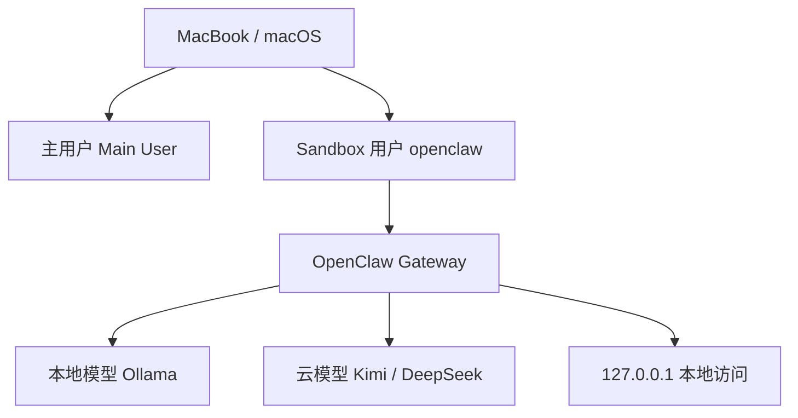

# 🦞 OpenClaw on macOS Sandbox User（单机多用户安全部署指南）

> 在只有一台 Mac 的情况下，使用独立标准用户（如 `openclaw`）部署 OpenClaw，构建安全、隔离、低污染的 AI Agent 环境。

---

## 🧠 核心理念

### 单机多用户 = 系统级沙箱

主工作环境 ≠ AI Agent 环境

通过 macOS 多用户机制实现：

- 主用户：日常办公 / 开发
- openclaw 用户：AI Agent / OpenClaw

---

## 🔒 为什么这样做？

### 安全性

- 不暴露公网（只监听 127.0.0.1）
- API Key 与主用户隔离
- 不污染主系统环境
- 可随时删除 sandbox 用户

### 可用性

- 无需服务器
- 无需 Docker
- 原生 macOS
- 启动简单

### 灵活性

- 多 user = 多 agent
- 本地模型 + 云模型自由切换
- 可独立测试环境

---

## 🏗️ 架构图

## ⚙️ 最低配置（MVP）

macOS + 标准用户 + Homebrew + Node.js + OpenClaw + API Key

---

## 🚀 完整部署步骤

### Step 1：创建 Sandbox 用户

路径：

System Settings → Users & Groups → Add User

推荐：

用户名：openclaw  
类型：Standard  

### Step 2：登录新用户

切换到 `openclaw` 用户并打开 Terminal。

### Step 3：安装 Homebrew

    /bin/bash -c "$(curl -fsSL https://raw.githubusercontent.com/Homebrew/install/HEAD/install.sh)"

配置环境：

    echo 'eval "$(/opt/homebrew/bin/brew shellenv)"' >> ~/.zprofile
    eval "$(/opt/homebrew/bin/brew shellenv)"

验证：

    brew -v

### Step 4：安装 Node.js

    brew install node@22
    node -v
    npm -v

### Step 5：安装 OpenClaw

推荐方式：

    curl -fsSL https://openclaw.ai/install.sh | bash

备用方式（npm）：

    npm install -g openclaw

如果权限报错：

    mkdir -p ~/.npm-global
    npm config set prefix '~/.npm-global'
    echo 'export PATH=$HOME/.npm-global/bin:$PATH' >> ~/.zshrc
    source ~/.zshrc

不推荐：

    sudo npm install -g openclaw

### Step 6：初始化配置

    openclaw configure

请选择以下配置：

- Onboarding：QuickStart
- Gateway：Local gateway
- Workspace：默认
- Default model：Keep current
- Port：18789
- Gateway bind：Loopback (127.0.0.1)
- Gateway auth：Token
- Tailscale exposure：Off
- Token source：Generate/store plaintext token
- Search provider：Brave 或 Skip
- Hooks：Skip
- Service：Yes

### 推荐配置总结

QuickStart  
Local gateway  
127.0.0.1  
Token  
Tailscale Off  
Service Yes

---

## 🔑 API Key 配置

编辑：

    nano ~/.zshrc

加入：

    export MOONSHOT_API_KEY="your_key"
    export DEEPSEEK_API_KEY="your_key"
    export STEP_API_KEY="your_key"

生效：

    source ~/.zshrc

### LaunchAgent 同步（非常重要）

    launchctl setenv MOONSHOT_API_KEY "your_key"
    launchctl setenv DEEPSEEK_API_KEY "your_key"
    launchctl setenv STEP_API_KEY "your_key"

---

## 🚀 启动与验证

    openclaw gateway restart
    openclaw gateway status
    openclaw gateway probe

浏览器访问：

http://127.0.0.1:18789/

---

## 💻 本地模型（可选）

    brew install ollama
    ollama serve
    ollama pull qwen2.5:7b

---

## 🔐 安全模型总结

- 用户隔离（macOS 多用户）
- 本地绑定（127.0.0.1）
- Token 认证
- 无公网暴露

---

## 🧹 重置环境

如果需要完全重置：

    rm -rf ~/.openclaw
    openclaw configure

---

## 🎯 总结

一台 Mac + 多用户 = 安全 AI 沙箱
