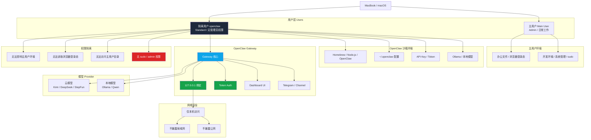

# 🦞 OpenClaw on macOS Sandbox User（单机多用户安全部署指南）

> 在只有一台 Mac 的情况下，使用独立标准用户（如 `openclaw`）部署 OpenClaw，构建安全、隔离、低污染的 AI Agent 环境。

## 🧠 核心理念

### 单机多用户 = 系统级沙箱

主工作环境 ≠ AI Agent 环境

通过 macOS 多用户机制实现：

- 主用户：日常办公 / 开发
- openclaw 用户：AI Agent / OpenClaw

## 🔒 为什么这样做？

### 安全性

- 不暴露公网（只监听 127.0.0.1）
- API Key 与主用户隔离
- 不污染主系统环境
- 可随时删除 sandbox 用户

### 可用性

- 无需服务器
- 无需 Docker
- 原生 macOS
- 启动简单

### 灵活性

- 多 user = 多 agent
- 本地模型 + 云模型自由切换
- 可独立测试环境

## 🏗️ 架构设计（安全边界与权限边界）

### 设计目标

在只有一台 macOS 设备的情况下，通过创建一个**独立的标准用户 `openclaw`**，把 AI Agent 的运行环境与主工作环境隔离开来。

核心思路：

- **主用户**：日常办公、浏览器登录态、个人文件、开发环境
- **openclaw 用户**：专门运行 OpenClaw
- **OpenClaw Gateway**：仅监听 `127.0.0.1`
- **网络访问**：默认仅本机访问，不暴露到局域网或公网
- **模型与密钥**：仅保存在 `openclaw` 用户环境中

### Mermaid 架构图

## ⚙️ 最低配置（MVP）

macOS + 标准用户 + Homebrew + Node.js + OpenClaw + API Key

## 🚀 完整部署步骤

### Step 1：创建 Sandbox 用户

路径：

System Settings → Users & Groups → Add User

推荐：

用户名：openclaw  
类型：Standard  

### Step 2：登录新用户

切换到 `openclaw` 用户并打开 Terminal。

### Step 3：安装 Homebrew

    /bin/bash -c "$(curl -fsSL https://raw.githubusercontent.com/Homebrew/install/HEAD/install.sh)"

配置环境：

    echo 'eval "$(/opt/homebrew/bin/brew shellenv)"' >> ~/.zprofile
    eval "$(/opt/homebrew/bin/brew shellenv)"

验证：

    brew -v

### Step 4：安装 Node.js

    brew install node@22
    node -v
    npm -v

### Step 5：安装 OpenClaw

推荐方式：

    curl -fsSL https://openclaw.ai/install.sh | bash

备用方式（npm）：

    npm install -g openclaw

如果权限报错：

    mkdir -p ~/.npm-global
    npm config set prefix '~/.npm-global'
    echo 'export PATH=$HOME/.npm-global/bin:$PATH' >> ~/.zshrc
    source ~/.zshrc

不推荐：

    sudo npm install -g openclaw

### Step 6：初始化配置

    openclaw configure

请选择以下配置：

- Onboarding：QuickStart
- Gateway：Local gateway
- Workspace：默认
- Default model：Keep current
- Port：18789
- Gateway bind：Loopback (127.0.0.1)
- Gateway auth：Token
- Tailscale exposure：Off
- Token source：Generate/store plaintext token
- Search provider：Brave 或 Skip
- Hooks：Skip
- Service：Yes

### 推荐配置总结

QuickStart  
Local gateway  
127.0.0.1  
Token  
Tailscale Off  
Service Yes

## 🔑 API Key 配置

编辑：

    nano ~/.zshrc

加入：

    export MOONSHOT_API_KEY="your_key"
    export DEEPSEEK_API_KEY="your_key"
    export STEP_API_KEY="your_key"

生效：

    source ~/.zshrc

### LaunchAgent 同步（非常重要）

    launchctl setenv MOONSHOT_API_KEY "your_key"
    launchctl setenv DEEPSEEK_API_KEY "your_key"
    launchctl setenv STEP_API_KEY "your_key"

## 🚀 启动与验证

    openclaw gateway restart
    openclaw gateway status
    openclaw gateway probe

浏览器访问：

http://127.0.0.1:18789/

## 💻 本地模型（可选）

    brew install ollama
    ollama serve
    ollama pull qwen2.5:7b

## 🔐 安全模型总结

- 用户隔离（macOS 多用户）
- 本地绑定（127.0.0.1）
- Token 认证
- 无公网暴露

## 🧹 重置环境

如果需要完全重置：

    rm -rf ~/.openclaw
    openclaw configure

## ⚡ Quick Debug（小白必备）

### 1️⃣ 检查服务是否正常

    openclaw gateway status

👉 正常应显示：running

### 2️⃣ 测试连接

    openclaw gateway probe

👉 用来确认 OpenClaw 是否可用

### 3️⃣ 重启（最常用修复）

    openclaw gateway restart

👉 出问题先重启，一半问题能解决

### 4️⃣ 查看日志（如果没反应）

    tail -f /tmp/openclaw/openclaw-*.log

👉 看有没有报错

### 5️⃣ 检查模型是否可用

    openclaw models list

👉 确认模型存在

### 6️⃣ 检查 API Key 是否生效

    echo $MOONSHOT_API_KEY

👉 如果是空的，需要重新配置

## 🗂️ 跨用户文件共享（/Users/Shared）

在本方案中，`openclaw` 用户与主用户是隔离的。  
为了在**安全范围内进行数据交换**，推荐使用 macOS 自带的共享目录：

    /Users/Shared
    
### 🧭 Finder 中的实际路径

在 Finder 左侧可以看到：

- Macintosh HD（或你的系统盘名称）

进入后路径为：

    Macintosh HD
    └── Users
        ├── 主用户（你的用户名）
        ├── openclaw（沙箱用户）
        └── Shared  ← ⭐ 关键目录

### 📌 关键理解

- `Shared` 与各个用户目录是**同级**
- 它**不属于任何一个用户**
- 所有用户都可以访问这个目录

👉 这是 macOS 官方提供的跨用户共享机制

### 🔐 安全模型（为什么是这里）

相比直接访问其他用户目录：

    /Users/username/

Shared 的优势：

- 不需要管理员权限
- 不破坏用户隔离
- 不暴露用户 Home 目录
- 不涉及权限提升（sudo）

### 🧠 在你的 OpenClaw 架构中的作用

    主用户（Main User）
        ↓
    /Users/Shared   ← 数据交换层
        ↓
    openclaw 用户（Sandbox）

### ⚠️ 不要误用的位置

❌ 不要这样做：

- 把文件放进：

      /Users/主用户/Desktop

  → openclaw 用户无法访问

❌ 不要这样做：

- 访问：

      /Users/其他用户/

  → 会触发权限限制

### 🎯 推荐实践

统一使用：

    /Users/Shared/openclaw-input
    /Users/Shared/openclaw-output

作为唯一数据通道

Shared 目录位于：

    Macintosh HD → Users → Shared

它是 macOS 唯一官方推荐的跨用户安全共享空间。
